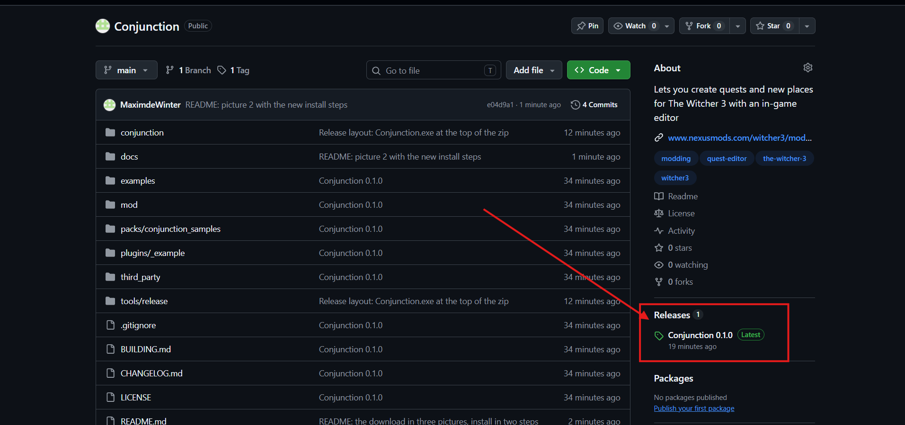
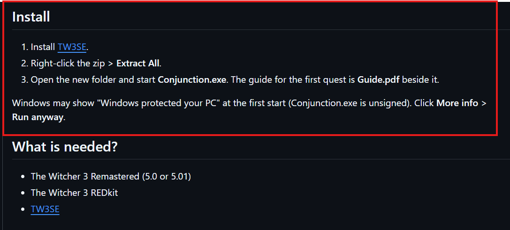
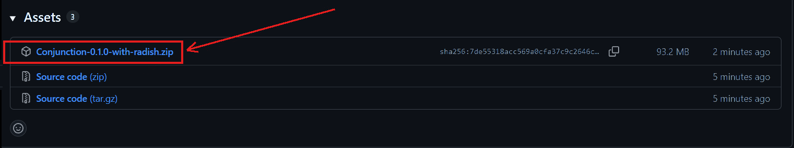

# Conjunction

Lets you create quests and new places for The Witcher 3 with an in-game editor.

Conjunction is an editor that runs as a separate app on top of the game. You can fly freely, place NPCs and objects
with a mouse click, and build a quest from nodes in a graph: goals the player has to complete, actions the game carries
out, dialogues, choices and an end. **Build & Play** turns the project into a mod and starts it in the game. **Export**
makes a folder with a zip to upload. Players install only the quest.

## What is needed?

| who | needs | start here |
|---|---|---|
| **Players** of quests made with Conjunction | The Witcher 3 Remastered (5.0 or 5.01). [TW3SE](https://www.nexusmods.com/witcher3/mods/13837) for quests that change the world. The [Conjunction Runtime](https://www.nexusmods.com/witcher3/mods/13916?tab=files) (an optional file of Conjunction) removes quests cleanly | Unpack the quest's zip into the game folder, or use a mod manager |
| **Quest makers** | The Witcher 3 Remastered (5.0 or 5.01), The Witcher 3 REDkit, [TW3SE](https://www.nexusmods.com/witcher3/mods/13837) and the [radish modding tools](https://www.nexusmods.com/witcher3/mods/3620) | the guide [docs/first-quest.pdf](docs/first-quest.pdf) (slides with pictures from the game), or the long version [docs/first-quest.md](docs/first-quest.md) |
| **Mod authors** with furniture, items, armour or NPCs | their mod | [docs/content-creators.md](docs/content-creators.md): make the mod a content pack that quests can use |

## Download

[**Download Conjunction**](https://github.com/MaximdeWinter/Conjunction/releases/latest)

**1.** Click the release under **Releases** (right side)

**2.** Install TW3SE first

**3.** Click **Conjunction-<version>-with-radish.zip**

The zip has the radish modding tools inside. The green **Code** button downloads the source code (for developers). Conjunction.exe is in the zip under **Releases**.

Conjunction is also on [Nexus Mods](https://www.nexusmods.com/witcher3/mods/13916). The Nexus download needs the
[radish modding tools](https://www.nexusmods.com/witcher3/mods/3620) zip as well (Manual download). Conjunction finds
it in your Downloads folder.

## Install and first start

1. Install and set up [TW3SE](https://www.nexusmods.com/witcher3/mods/13837) correctly.
2. Right-click the downloaded Conjunction zip and **Extract All**. Open the folder and start **Conjunction.exe**.

Windows may show "Windows protected your PC" at the first start (Conjunction.exe is unsigned). Click
**More info** > **Run anyway**.

The first start finds the game by itself (Steam libraries, GOG) and asks for it if it can't. It puts Conjunction's
scripts into the game and builds the list of the game's NPCs, objects and items for the Asset Browser (a few minutes).
If TW3SE or radish is missing, Conjunction shows its Nexus page. A profile is optional, see
[Profiles](#profiles-and-history).

To update, unpack the new zip over the old folder.

**Updates**: turn on Settings > General > **Check for updates at start**. Conjunction then asks Nexus Mods whether
Conjunction, TW3SE or a content pack has a newer version, and shows it with a link to its page.
Conjunction keeps the Runtime in the game up to date by itself.

## The app

The pages on the left:

| page | what it is for |
|---|---|
| **Projects** | your projects and the examples. **New project** (a Quest or a Place mod), **Open ingame**, **History**, **Add folder** |
| **Library** | quest files (`.w3q`) to play, and the content packs in the game |
| **Settings** | General (sound, updates), Game (the game, REDkit and radish folders), Tools, Plug-ins, Profile |

Plug-ins can add pages of their own.

## Projects

Everything you make with Conjunction is a **project**, and a project becomes one mod. There are two kinds:

- **Quest**: steps, dialogues and a journal entry. Its NPCs and objects are in the world while the quest runs.
- **Place mod**: things that are always in the world, like a house or a camp.

A project has one or more **locations** (the **Places** tab): groups of NPCs and objects that appear and disappear
together. Every change is saved right away.

One project is in the game at a time. Opening another one saves the game and restarts it with only that project.

## The editor in the game

**Open ingame** starts the game. Once a save is loaded, the editor's bar appears at the top.

- **F8** switches between editing and playing. While you edit, the game stands still and you fly the camera. While you
  play, you control Geralt as usual. **Esc** brings you back to editing.
- **File** > **Game menu ...** opens the game's own menu (save, load, settings).
- The bar has three modes: **Select** picks objects and NPCs you placed, **Asset Browser** places new ones, **Look**
  only moves the camera. Each shows its key.
- Under the bar are the options of the mode: lamp, time of day, fly speed, grid, collision, snap to ground. With a
  selection: drop, duplicate and delete.
- **Project** at the top right opens the project panel with **Places**, **Quest** and **Build**.
- **Build & Play** at the top right builds the project and starts it in the game.

| key / mouse | what it does |
|---|---|
| F8 | editing on / off |
| Esc | while playing: back to editing. While placing or picking: cancel |
| right mouse button held | look around |
| W A S D, Space, X | fly; Space up, X down |
| F held + mouse wheel | fly speed |
| click | Select: picks an object or NPC of the project. Asset Browser: places what you chose |
| Shift + click | Multi select |
| mouse wheel | turns the selection (Shift: 1°); Alt: pitch, Tab: roll |
| End | drops the selection onto the ground |
| H | lamp on the camera on / off; hold H and turn the wheel to dim it |
| Del, short right click | deletes the selection |
| Ctrl+Z / Ctrl+D | undo / duplicate the selection |
| Ctrl+C / Ctrl+V | copy the selection / put it under the cursor |
| F11 | screenshot (`Documents\Conjunction\screenshots`) |

**Edit** > **Keyboard shortcuts** gives any action a key of your own. Every control has a tooltip.

The **Asset Browser** has every NPC, creature, object and item of your game, sorted by category (People, Creatures,
Containers ...), by style (Novigrad, Skellige, Toussaint ...) and by what a thing can do (inventory, lootable, usable,
light). A green speech mark means the NPC can speak in a dialogue (the mouth moves with the lines), a red one means it
stays silent.

A tile with a tab and a number is a folder. "5 variants" are different people of one kind, "9 looks" are one person in
different clothes and faces. A yellow speech mark on a folder means some of them can speak and some stay silent.
**Place random** places one of them at random. A double click opens the folder, and you choose one yourself.

Click an entry to see it on the right. **Place** puts it under the cursor, and a click into the world sets it down.
While you place, the panel turns see-through and the bottom of the screen says what the next click does.

## Quests

**Project** > **Quest** shows the quest as a graph. It runs from **QUEST STARTS** down, one step after the other. There
are six blocks:

- **Goal**: something the player has to do (talk, go to, collect, kill, find clues, gwent ...). The journal shows it
  as an objective.
- **Action**: something the game does by itself (a reward, a weather change, an NPC turning hostile).
- **Choice**: splits the quest into branches (either / or, at random, or by a condition).
- **Meanwhile**: a track that runs alongside the story.
- **Chapter**: a heading for a part of a long quest.
- **End**: closes the quest as completed or failed.

Click a step to open its card below the graph and fill in its fields. What is missing is written in red. Dialogues have
their own editor with lines, the player's choices and conditions.

- the first quest, step by step: [docs/first-quest.md](docs/first-quest.md)
- every block, card and dialogue option: [docs/quest-graph.md](docs/quest-graph.md)
- hide areas (hide grass, ground or water in your own cellar or cave): [docs/world-changes.md](docs/world-changes.md)
- your own voice recordings: [docs/content-packs.md](docs/content-packs.md)

## Testing

- **Build** > **Check** (seconds): plays the quest through with a stand-in player and says where a branch would get
  stuck.
- **Build & Play** (one to two minutes): the game saves and closes, the quest is built, and the game starts again with
  that save. The quest starts fresh.
- **Play from here** (a step's **···** menu): starts the quest at that step, with the items the steps before would have
  given.

## Reporting a bug

**Help** > **Report a bug** in the game (or **Report a bug** in the app) opens a window. Write what happened and what
you expected. **Add screenshot** takes a picture of the game, and you can draw on it to mark the problem. **Save
report** saves one file in the `bug-reports` folder (see [Folders](#folders)) with your text, the screenshots, the logs,
the open project and the installed mods. Your names, the PC's name and your profile are taken out. Nothing is sent.

**Copy for Nexus** puts a short text of the report on the clipboard. Paste it into the **Bugs** tab of Conjunction's
Nexus page. The author may ask you for the saved file.

## Sharing quests

**Build** > **Export quest file** first shows the quest's name, where it starts and its description, as the quest's
Nexus page will show them. Change them if you like. Any project can be exported there: choose it at the top (the open
one is first). **Show exported quests** opens the folder with all exports, **Open last export** the newest one of the
chosen project. Then it builds the quest under its own name and opens the folder
`Documents\Conjunction\exports\<quest name>\` with:

- a zip for Nexus and mod managers
- the quest file (`.w3q`) for Conjunction's Library
- a text for the quest's Nexus page: what it is, where it starts, what it needs

The quest carries everything it needs and runs on its own. The project itself goes in only if **Include the project**
is ticked.

**Mods a quest uses**: the Build tab lists them above **Export quest file**, each with the things the quest takes from
it. A content pack names itself. For any other mod you type its name, version and link once. A player who lacks one of
them is told which mod is missing and where to get it:

    Needs Medieval Furniture 1.2 by Carpenter                 [Get]
    For: oak chair, long table, Oak goblet

**Quest files**: players with Conjunction put `.w3q` files into `Documents\Conjunction\quests` (**Library** opens the
folder). Conjunction installs them at its next start.

**Several quests**: every quest has its own id, facts, tags, journal entries and text ids, so quests made with
Conjunction run side by side. If two quests would still clash, the Library points them out. A quest can start right away when the save is loaded, together with a quest of the game, or after one (**Starts** on the card of QUEST STARTS).

## Profiles and history

A profile is optional. It is a name and a key, made in Settings > Profile > **New profile**. With a profile,
everything you make is signed with it. The key is one file in `Documents\Conjunction\identity\<name>.cjkey`
(Settings > Profile > **Show key file** opens its folder). Keep it safe. Never share it: whoever has
it can sign as you. You can have several profiles, each with its own key.

- **History** (Projects > **History**): every step of a project (made, edited, built, exported) with the profile, the
  tools and the time, each signed and chained to the one before. If the history gets manipulated, it will tell you so. The history
  goes into the built quest and the exported file.
- **Marks**: the built quest and its placed objects carry marks of your profile in values the quest has anyway. They
  stay when someone removes the history.
- **Check origin** (Settings > Profile): shows the history of a quest file, a project or an installed quest, and
  whether one of your profiles made it.
- **Public timestamp** (Settings > Profile, off by default): the export registers the history with the OpenTimestamps
  calendars and puts the proof into the quest file. It proves when your quest existed (opentimestamps.org).

## Folders

Everything Conjunction keeps is in **Documents\Conjunction**:

| folder | holds |
|---|---|
| `projects` | your projects (one folder each) |
| `quests` | quest files (`.w3q`) to play |
| `exports` | quests you exported to share |
| `bug-reports` | saved bug reports |
| `plugins` | plug-ins, one folder each |
| `screenshots` | F11 in the editor |
| `tools` | the radish modding tools, unpacked from their zip |
| `data` | settings, caches and logs |
| `identity` | profile keys (keep them, never share them) |

## Credits

Made by MaximdeWinter: idea, design, testing in the game and direction.

Code written together with Claude Opus 5.5.

- [radish modding tools](https://www.nexusmods.com/witcher3/mods/3620): rmemr
- The Witcher 3 REDkit / wcc_lite: CD PROJEKT RED
- The quest graph follows the look and the wire router of [PathView](https://github.com/pathsim/pathview) by
  milanofthe (MIT)

## License

You may use Conjunction and change it for your own use. Quests and mods made with it are yours to share. Conjunction
itself (also changed) may only be downloaded from its official pages. The full text is in LICENSE.
