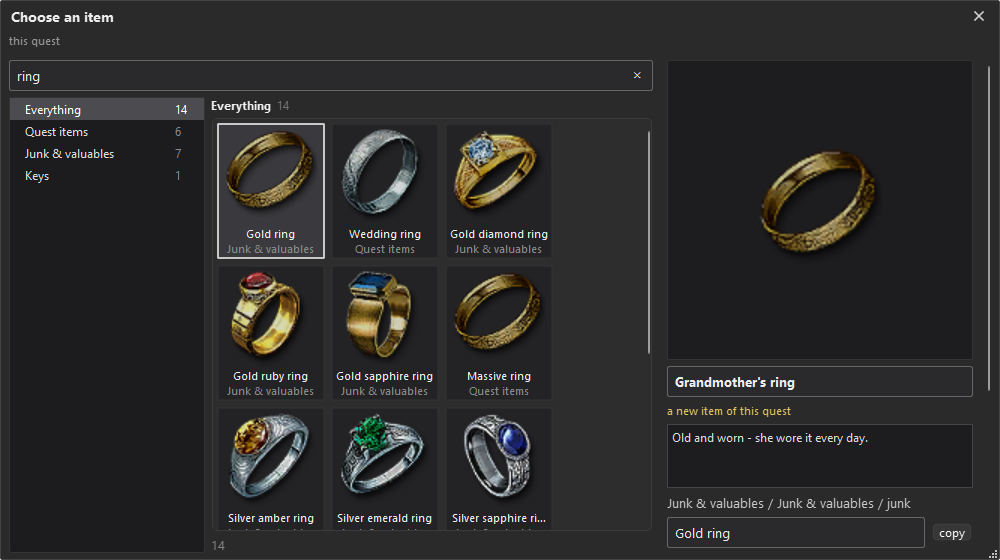
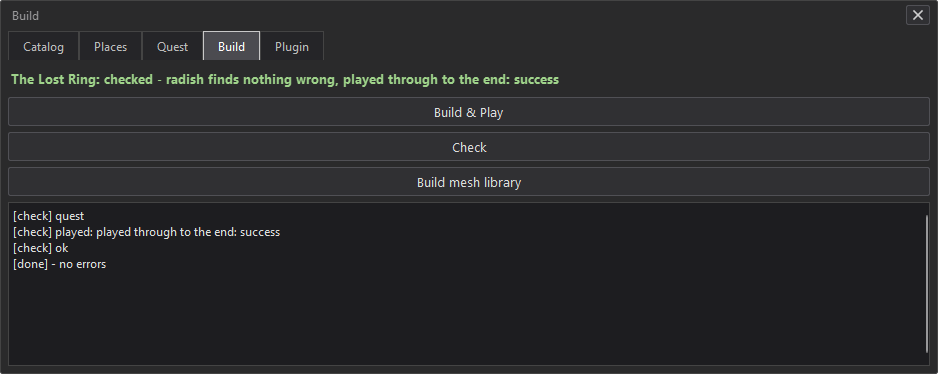

# Your first quest

A villager lost her ring to bandits. The player has to talk to her, find the chest with the ring, bring it back and
get paid. On the way you learn how a quest in Conjunction is put together: projects, steps, dialogues, items,
testing and sharing. About 20 minutes.

The same quest as slides with pictures from the game: [first-quest.pdf](first-quest.pdf). Every block and kind of
step is explained in [quest-graph.md](quest-graph.md).

You need The Witcher 3 (Remastered, 5.0 or 5.01), The Witcher 3 REDkit and
[TW3SE](https://www.nexusmods.com/witcher3/mods/13837) and the [radish modding tools](https://www.nexusmods.com/witcher3/mods/3620) (download
the zip; Conjunction finds it in your Downloads folder).

## 1. A project

Everything you make with Conjunction lives in a **project**: the quest, the NPCs and objects placed for it, its items
and dialogues. A project becomes one mod. There are two kinds:

- **Quest**: steps, dialogues and a journal entry. Its NPCs and objects are in the world while the quest runs.
- **Place mod**: things that are always in the world, like a house or a camp.

Start **Conjunction**. On **Projects**, press **New project**, name it `The Lost Ring`, choose **Quest** and press
**Create and open ingame**. The game starts by itself and loads your last save. Go to an open area where the quest
should take place.

Only one project is in the game at a time. Opening another one (**File** > **Open project ...**, or a project on
the **Projects** page) restarts the game with only that project in it.

## 2. The editor

Once the save is loaded, the editor's bar appears at the top of the game.

- **F8** switches between editing and playing. While you edit, the game stands still and the camera flies freely.
  While you play, you control the player as usual; **Esc** brings you back to editing.
- **Camera**: hold the right mouse button to look around, **W A S D** to fly, **Space** up, **X** down. Hold **F**
  and turn the mouse wheel to change the fly speed.
- **File** > **Game menu ...** opens the game's own menu (save, load, settings).

The bar has three modes. Each shows its key next to it.

- **Select** picks objects and NPCs you placed. A selected object can be moved with its arrows, turned with the mouse
  wheel, duplicated (**Ctrl+D**) or deleted (**Del**).
- **Asset Browser** is the catalog of everything the game has: NPCs, creatures, objects and items, sorted into
  categories and searchable. Click an entry to see it on the right, **Place** puts it under the cursor, a click into
  the world sets it down.
- **Look** only moves the camera.

**Project** at the top right opens the project panel with the tabs **Places** (the locations of the project and the
objects in them), **Quest** (the quest graph) and **Build** (testing and exporting). Every change is saved right
away. **Ctrl+Z** undoes.

## 3. How a quest is built

**Project** > **Quest**. The name at the top is the quest's name in the journal. Below it is the quest graph.

A quest is a chain of **steps** that runs from top to bottom, starting at **QUEST STARTS**. The line between two steps
is the order: when a step is done, the quest follows its line to the next one. Click **QUEST STARTS** to set the
quest's journal section (main quest, side quest, contract, treasure hunt), its journal entry and when it starts:
**Starts automatically** (at once), **With a game quest ...** (as soon as that quest of the game starts) or **After a
game quest ...** (once it is over). The last two open the story map: click a quest and press **Start my quest with
this** or **Start my quest after this**. The quest enters the journal and its NPCs the world when it starts.

New steps come from the blocks on the left:

- **Goal**: something the player has to do (talk to someone, go somewhere, collect something). The quest waits until
  it is done, and the journal shows it as an objective.
- **Action**: something the game does by itself (a reward, a weather change, an NPC turning hostile). It happens at
  once and the quest goes on.
- **Choice**: splits the quest into branches (either / or, at random, or by a condition).
- **Meanwhile**: a parallel track, steps that run alongside the story.
- **Chapter**: a heading for a part of a long quest.
- **End**: closes the quest as completed or failed.

Click a block to add it after the selected step, or drag it onto a line to put it in between. The **▾** next to a
step's kind chooses what exactly it is: a Goal can be Talk, Go to, Collect, Kill and more.

Click a step to open its **card** below the graph, where you fill in its fields. The top line of the card is the
objective the journal shows; leave it as it is or write your own. Whatever is still missing is written in red, on the
step and on the card (`Missing: character`). A step's **output** is the small square at its bottom: until it leads to
the next step or to an End, the step says `output not wired`.

## 4. Step 1: talk to the villager

Click **Goal** and set its kind to **Talk**. A Talk is a dialogue the player has to have with an NPC.

The card asks **who**. **choose who** opens a list:

- **Pick in world**: click an NPC of this project in the world
- **Create a new person**: place a new NPC
- below: the NPCs already placed in this project, with a search

Choose **Create a new person**. The Asset Browser opens on NPCs. Search for townswoman and double click **Rich
Townswoman**. She is a folder with her 9 looks. A green speech mark means the look can speak in a dialogue (the mouth
moves with the lines), a red one means it stays silent. Click a look with a green mark to see it on the right, press
**Place** and click where she should stand. While you place, the panel turns see-through, and the bottom of the
screen says what the next click does (**Esc** cancels). She now belongs to the quest, and the card shows her under
**who**.

**starts** decides how the dialogue begins:

| starts | the dialogue begins |
|---|---|
| On interaction (E) | when the player talks to her |
| When the player is near | by itself, when the player comes close |
| Overheard (the player listens) | as the player walks past; the player only listens |
| NPC calls out | she calls a line when the player comes close, then waits to be talked to |
| Immediately (cutscene) | right away, as a cutscene |

Choose **NPC calls out** and type what she calls: `Witcher! Over here!`

**Edit dialogue** opens the dialogue editor. A dialogue is built like the quest, from top to bottom, with its own
blocks:

- **Line**: something a character says. Click the name to change the speaker.
- **Choice**: options the player picks from.
- **If**: a branch that depends on a condition.

Each option ends in one way, shown on the option:

| ending | what happens |
|---|---|
| end: continue | the Talk is done, the quest goes on |
| end: repeatable | the dialogue ends, the Talk stays open; the player can come back later |
| end: fail quest | the quest fails |
| back to choice | the choice is shown again (for questions) |

Add her line: `Witcher! Bandits took my ring. They hid it somewhere in the woods.` Then add a **Choice** with two
options: `I'll find it.` with **end: continue**, `Not now.` with **end: repeatable**. In the graph the Talk now has
two outputs, **continue** and **repeatable**. **Back** returns to the quest.

A line can do more: a gesture, a mood, a camera, a voice from the game or a recording of your own. For short
dialogues the text is enough: the mouth moves to it by itself.

## 5. Step 2: the hiding place

Add a **Goal** of the kind **Go to**: the player has to reach a location.

Press **+ Set the spot**. A flag follows the cursor; click to put it down. The ring around the flag is the distance
at which the goal counts as reached. **more** on the card sets this distance, the marker on the map and a time of
day. The flag shows only while you edit. To move the spot later, select the flag and drag it.

Type the objective: `Find the bandits' hiding place`.

## 6. Step 3: the ring

Add a **Goal** of the kind **Collect**: the player has to carry an item. The card asks one thing after the other.

1. **what** > **+ item** opens the item window with every item of the game. Search `ring` and click one. On the right
   you can rename it and change its description: call it `Grandmother's ring`. A renamed item becomes a new item of
   this quest that looks like the original. **Choose item**.

   

2. **where** sets how the player gets it:
   - **in a container**: in a chest, a box or a sack
   - **a person carries it**: an NPC has it
   - **not placed**: the player finds or buys it elsewhere

   Choose **in a container**.
3. **in** > **Create a new container**: the Asset Browser opens on containers. Pick a chest, **Place** it near the
   flag.
4. **Random loot**: a container also holds the game's random loot for its kind. **Off**: only the ring is inside.

The step is done when the player carries the ring.

## 7. Step 4: bring it back

Add another **Goal**, **Talk**, and choose her under **who**: she is already placed.

In her dialogue, add a line (`Did you find it?`) and a Choice with the option `Here it is.` Under its **Effects**
choose **Player gives an item** and the ring. An option that hands over an item only shows while the player carries
it, and choosing it takes the item from the inventory. Give it **end: continue**, and a second option `Not yet.` with
**end: repeatable**. A Talk that hands something over is shown as **Deliver** in the graph.

Then add an **Action** of the kind **Reward**: 50 crowns and 50 experience (**+ item** adds items to it). Last, add an
**End** and drag the Reward's output onto it. Now every step leads somewhere and the red is gone.

## 8. Test it

**Project** > **Build** > **Check** takes a few seconds. It plays the quest through with a stand-in player. If a branch
would get stuck (a goal nobody can reach, an output that leads nowhere), it says where.

**Build & Play** at the top right turns the project into a mod and starts it: the game saves and closes, Conjunction
builds the quest, and the game starts again with that save. This takes one to two minutes. Then the quest runs the
way a player gets it, fresh from its first step. Open the journal: **The Lost Ring** is there. Walk up to the
villager.

To change something, press **F8**, change it and use Build & Play again. To test a later step right away, open
the step's **···** menu and choose **Play from here**: the quest starts at that step, with the items
the steps before would have given (the ring is in the inventory).

## 9. Share it

**Build** > **Export quest file** first shows the quest's name, where it starts and its description, as the quest's
Nexus page will show them. Change them if you like. Then it builds the quest under its own name and opens the folder
`Documents\Conjunction\exports\<quest name>\` with everything to upload:

- a zip for Nexus and mod managers
- the quest file (`.w3q`) for Conjunction's **Library**
- a text for the quest's Nexus page: what it is, where it starts, what it needs

Players install only the quest. The page text recommends the **Conjunction Runtime** (it puts the world back as it
was when a quest is removed) and names TW3SE when the quest changes the world.

A quest that uses things from other mods (furniture, items of a content pack) lists those mods on the Build tab above
**Export quest file**. A player who lacks one of them is told which mod is missing and where to get it, see
[content-creators.md](content-creators.md).

## Next

- an option that leads into a branch of its own: drag its output into the empty graph; drop steps on the new branch
- a later step that depends on that decision: **Choice** > **If**, with an output for yes and one for no
- enemies: **Goal** > **Kill**; a fight after a dialogue: **Action** > **Hostile**
- clues for the witcher senses: **Goal** > **Find clues**; an object to look at: **Examine**
- **Gwent** and **Fist fight** as goals, with an output for a lost game
- a different outcome each time: **Choice** > **At random**
- something alongside the story (a timer, remarks of a companion): **Meanwhile**; **Stop track** ends it
- a long quest: **Chapter** headings; **Jump to** at the top of the Quest tab goes to one
- a scene that plays by itself: a Talk's **starts** > **Immediately (cutscene)**
- NPCs who act: a line's **Gesture** > **Find another ...** lists the game's scene animations
- another region: **Action** > **Travel**
- a cellar or a cave of your own, with the game's grass, ground or water hidden: **Places** > **Hide area**, see
  [world-changes.md](world-changes.md)
- a place that stays in the world, like a house: **New project** > **Place mod**
- the example projects on **Projects** show all of it ready made
